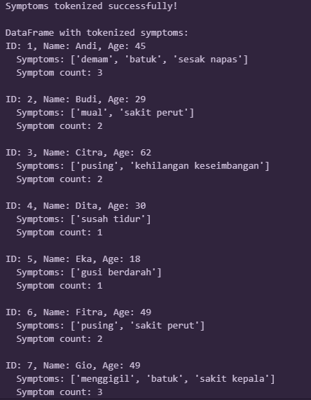
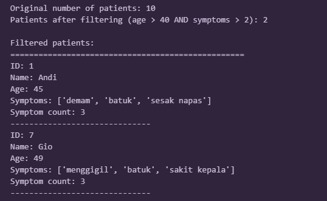
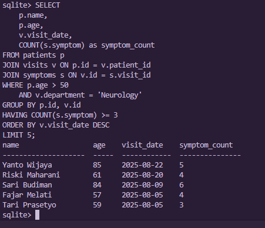
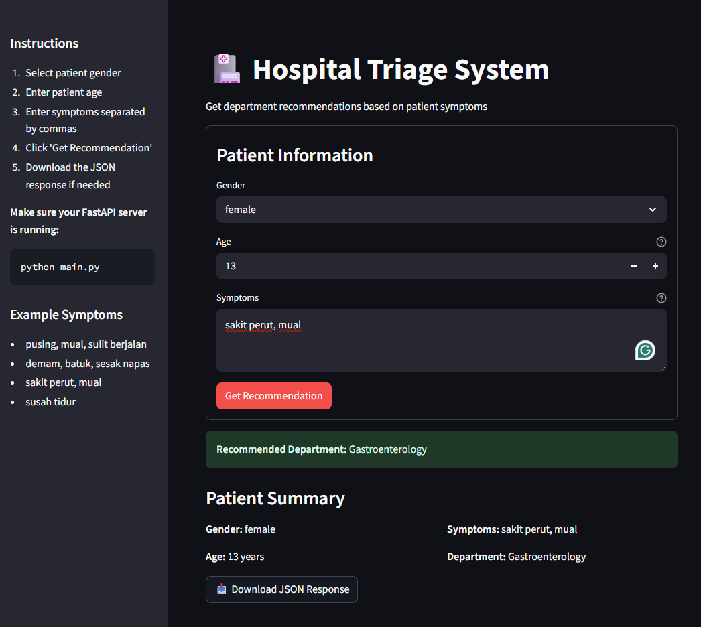

# BitHealth Technical Assessment

This repository contains solutions for the BitHealth technical assessment covering three main areas: Python data processing, SQL querying, and FastAPI development with LLM integration.

## Repository Folder Structure

### 1: Python Data Processing
- `filter_patients.ipynb` - Jupyter notebook with patient data filtering logic
- `patients.csv` - Patient dataset with symptoms information

### 2: SQL Database and Querying
- `setup.py` - Database schema creation script
- `insert_data.py` - Script to populate database with 500+ realistic patient records
- `cleardb.py` - Database cleanup utility
- `query.py` - Python script version of the final query
- `query.sql` - Final SQL query for submission
- `test_db` - Database testing utilities
- `hospital.db` - SQLite database file with patient, visit, and symptom data

### 3: FastAPI with LLM Integration
- `main.py` - FastAPI application with hospital triage recommendation endpoint
- `llm_service.py` - LangChain service for Google AI integration
- `streamlit_app.py` - Web interface for the triage system

---

## Installation and Setup

### Dependencies
```bash
# Case 1
pip install pandas jupyter

# Case 2
pip install sqlite3  # (built-in with Python)

# Case 3
pip install fastapi uvicorn streamlit requests langchain langchain-google-genai
```

### Environment Setup
1. Clone this repository
2. Install dependencies for each case as needed
3. For Case 3: Set up Google AI Studio API key in `main.py`
4. Run individual case components as documented in each section

---

## Case 1: Python - Basic Data Processing

### Objective
Test data wrangling, logic, and Python fluency through patient symptom analysis.

### Task Requirements
- Create CSV file with patient data (id, name, age, symptoms)
- Load and process the CSV data
- Tokenize symptoms into individual components
- Filter patients older than 40 with more than 2 symptoms

### Implementation
The solution uses pandas for data manipulation and implements a clean filtering pipeline:

1. **Data Creation**: Generated `patients.csv` with 10 patients as specified
2. **Data Loading**: Used pandas to read and process the CSV file
3. **Symptom Tokenization**: Split comma-separated symptoms into individual lists
4. **Filtering Logic**: Applied dual criteria (age > 40 AND symptoms > 2)

### Results
The filtering identified **2 patients** meeting the criteria:
- **Andi (45 years)**: 3 symptoms - "demam, batuk, sesak napas"
- **Gio (49 years)**: 3 symptoms - "menggigil, batuk, sakit kepala"
### Tokenize Output on ipynb

### Filtering Output on ipynb

---

## Case 2: SQL - Patient Visit Insights

### Objective
Test database design and complex SQL query capabilities.

### Challenge
The original task provided only database schema without actual data, requiring complete database setup and data generation.

### Solution Approach
Since no database was provided, I created a comprehensive data pipeline:

#### Database Design
- **patients**: Basic patient information (id, name, age)
- **visits**: Hospital visit records (id, patient_id, department, visit_date)
- **symptoms**: Individual symptoms per visit (id, visit_id, symptom)

#### Data Generation Strategy
- Created **500 patients** with realistic Indonesian names
- Generated **1800+ visits** across 6 medical departments
- Populated **4900+ symptom records** with medically appropriate symptoms
- Ensured sufficient data for query requirements (age > 50, Neurology department, ≥3 symptoms)

#### Final Query
```sql
SELECT 
    p.name,
    p.age,
    v.visit_date,
    COUNT(s.symptom) as symptom_count
FROM patients p
JOIN visits v ON p.id = v.patient_id
JOIN symptoms s ON v.id = s.visit_id
WHERE p.age > 50 
    AND v.department = 'Neurology'
GROUP BY p.id, v.id
HAVING COUNT(s.symptom) >= 3
ORDER BY v.visit_date DESC
LIMIT 5;
```
### Result Running in  Terminal

### Database Relationships
- **patients → visits**: One-to-Many (one patient can have multiple visits)
- **visits → symptoms**: One-to-Many (one visit can have multiple recorded symptoms)
- **patients → symptoms**: One-to-Many (indirect, through visits)


---

## Case 3: FastAPI - Hospital Triage System

### Objective
Build an end-to-end system integrating FastAPI, LLM services, and modern AI tooling.

### System Architecture

#### Backend API (`main.py`)
- FastAPI application with POST `/recommend` endpoint
- Accepts patient information (gender, age, symptoms)
- Returns department recommendation via JSON response

#### LLM Integration (`llm_service.py`)
- **LangChain** integration with **Google AI Studio (Gemini 2.5 Flash)**
- Prompt engineering for medical department routing
- Error handling with fallback to "General Medicine"
- Temperature tuning for consistent medical recommendations

#### Web Interface (`streamlit_app.py`)
- Clean form interface for patient data input
- Real-time API integration with the FastAPI backend
- JSON response download functionality
- Input validation and error handling
#### Preview



### Technical Implementation

#### API Endpoint
```python
@app.post("/recommend", response_model=RecommendationResponse)
async def recommend_department(patient: PatientInfo):
    recommended_dept = llm_service.get_department_recommendation(
        gender=patient.gender,
        age=patient.age,
        symptoms=patient.symptoms
    )
    return {"recommended_department": recommended_dept}
```

#### LLM Service Integration
- Uses **LangChain** with **Google Generative AI**
- Implements proper prompt templates for medical triage
- Handles API errors gracefully with fallback responses

### Usage Instructions

1. **Start the API server**:
   ```bash
   python main.py
   ```

2. **Launch the web interface**:
   ```bash
   streamlit run streamlit_app.py
   ```

3. **Access the system**:
   - API Documentation: `http://localhost:8000/docs`
   - Web Interface: `http://localhost:8501`

### Example Usage
**Input**:
```json
{
  "gender": "female",
  "age": 62,
  "symptoms": ["pusing", "mual", "sulit berjalan"]
}
```

**Output**:
```json
{
  "recommended_department": "Neurology"
}
```

---

## Key Technical Decisions

### Case 1: Data Processing
- Used pandas for efficient data manipulation
- Implemented clear separation of concerns (load → tokenize → filter)
- Added data validation and error handling

### Case 2: Database Design
- Chose SQLite for portability and ease of setup
- Designed normalized schema with proper foreign key relationships
- Generated realistic, culturally appropriate test data
- Ensured data distribution supports query requirements

### Case 3: API Architecture
- Selected FastAPI for modern Python API development
- Integrated LangChain for LLM provider flexibility
- Added Streamlit for user-friendly interface
- Implemented proper error handling and input validation

---

## Testing and Validation

All solutions have been tested and validated:
- **Case 1**: Verified filtering logic with provided dataset
- **Case 2**: Confirmed query returns required results with proper data relationships
- **Case 3**: Tested API endpoints and web interface functionality

This comprehensive solution demonstrates proficiency in Python development, database design, SQL querying, API development, and modern AI integration techniques.